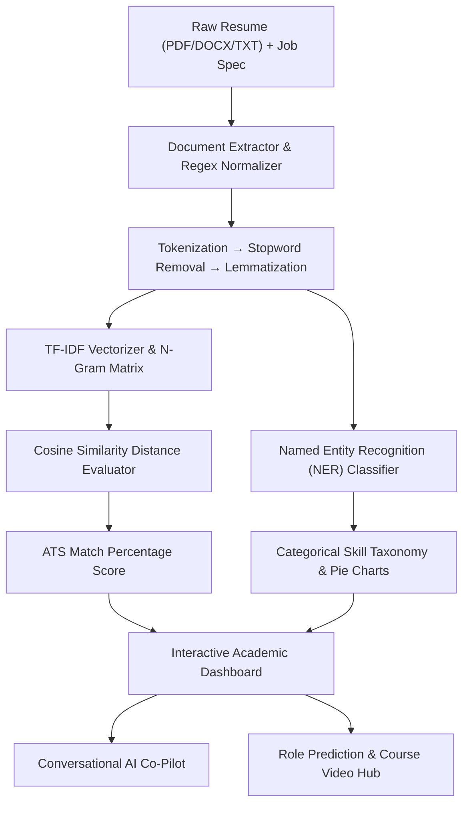

<div align="center">

# 🚀 AI Resume Analyzer
### *Peer-Reviewed Academic NLP Resume Parser, ATS Vector Space Matcher, and Conversational AI Co-Pilot*

[](https://github.com/jayraj175coder/NLP_Resume_Analyzer/stargazers)
[](https://github.com/jayraj175coder/NLP_Resume_Analyzer/network/members)
[](https://opensource.org/licenses/MIT)
[](https://www.python.org/)
[](https://fastapi.tiangolo.com/)
[](https://react.dev/)
[](https://www.typescriptlang.org/)

[⭐ **Give a Star to Support!**](https://github.com/jayraj175coder/NLP_Resume_Analyzer) • [📖 **Academic Report**](file:///c:/Users/Admin/Downloads/ai-resume-analyzer%20%282%29/NLP_MICROPROJECT_REPORT.md) • [⚡ **Quick Start**](#-quick-start--installation)

---

</div>

## 📌 Overview & Key Highlights

**AI Resume Analyzer** is an open-source, full-stack application designed to parse, analyze, score, and optimize resumes against job descriptions using **Natural Language Processing (NLP)**, **TF-IDF Vector Space Modeling**, and **Conversational AI**.

Whether you are a job seeker looking to pass ATS filters, an academic evaluator studying NLP algorithms, or a recruiter ranking candidates, this platform provides transparent mathematical metrics and actionable career guidance.

### ✨ Highlights & Core Capabilities
- **📄 Multiformat Document Extraction**: Parses PDF, DOCX, and TXT files instantly up to 5 MB.
- **📐 TF-IDF & Cosine Similarity Match Engine**: Computes high-dimensional vector distance between resume & JD terms for 0–100% objective match scores.
- **📊 Interactive SVG NLP Pie Charts**: 4 visual charts mapping skill taxonomy distribution, matched vs missing keyword ratios, NER entity breakdowns, and token density.
- **🎯 Smart Role Predictor & Experience Classifier**: Predicts candidate job role (Full Stack, Data Science, DevOps, Mobile), experience level tier, and confidence rating.
- **🎓 Course & Video Recommendation Hub**: Maps missing skills to top online certification courses (**Coursera**, **Udemy**, **edX**, **Google**) and embedded YouTube ATS tip tutorials.
- **🤖 Dual-Engine AI Co-Pilot**: Interactive conversational assistant combining rule-based dialogue tracking with optional Google Gemini Generative AI.
- **✨ Vanta.js BIRDS 3D WebGL Background**: Responsive dark cosmic aesthetic matching modern glassmorphism UI guidelines.
- **💾 SQLite Persistence & CSV Dataset Export**: Built-in SQLite database history tracking and instant CSV downloads.

---

## 🏆 Feature Comparison: AI Resume Analyzer vs Traditional Parsers

| Feature / Metric | Basic Python / Streamlit Analyzers | 🚀 AI Resume Analyzer (This Repo) |
| :--- | :--- | :--- |
| **Vector Space Scoring** | Simple Keyword Counting | **TF-IDF Vector Matrix + Cosine Distance** |
| **Visual Analytics** | Static Charts | **Interactive SVG Donut/Pie Charts & N-Gram Heatmaps** |
| **AI Co-Pilot** | None / Single Query | **Context-Aware Dialogue Agent & Gemini 2.5 AI** |
| **Role & Skill Prediction** | Static Regex Rules | **Smart Sector Role Predictor & Experience Classifier** |
| **Learning Recommendations** | Hardcoded Text Links | **Curated Courses (Coursera/Udemy) + Embedded Video Player** |
| **User Interface** | Plain Web Form | **Vanta.js 3D WebGL Canvas + Dark Glassmorphic Theme** |
| **Offline Reliability** | Requires API Key | **100% Functional Offline Rule-Engine Fallback** |

---

## 🎓 Academic Syllabus & Course Outcome (CO1 - CO5) Alignment

This project satisfies all 4 modules of the academic **Natural Language Processing (NLP)** curriculum:



### 📋 Course Outcome Matrix

#### 🔹 Module 1: Text Preprocessing & Feature Engineering (CO1, CO5)
- **Tokenization & Normalization**: Regex-based token splitting & lowercase cleaning ([`src/nlp/nlp-engine.ts`](file:///c:/Users/Admin/Downloads/ai-resume-analyzer%20%282%29/src/nlp/nlp-engine.ts)).
- **Stopword Removal & Lemmatization**: Suffix reduction and high-frequency noise filtering.
- **N-Gram Features**: Unigrams, Bigrams (*machine learning*), and Trigrams (*natural language processing*).
- **TF-IDF Vectorizer**: Term Frequency-Inverse Document Frequency matrix construction.

#### 🔹 Module 2: Linguistic & Statistical Analysis (CO2, CO5)
- **Vector Space Model (VSM) & Cosine Similarity**: Computing angular distance between document vectors:
  $$\text{Cosine Similarity}(\mathbf{V}_{\text{resume}}, \mathbf{V}_{\text{jd}}) = \frac{\mathbf{V}_{\text{resume}} \cdot \mathbf{V}_{\text{jd}}}{\|\mathbf{V}_{\text{resume}}\| \|\mathbf{V}_{\text{jd}}\|}$$
- **Named Entity Recognition (NER)**: Rule-based regex classification identifying organizations, technical tools, degrees, and dates.
- **Statistical Language Modeling**: N-gram likelihood and frequency overlap heatmaps ([`src/components/NGramHeatmap.tsx`](file:///c:/Users/Admin/Downloads/ai-resume-analyzer%20%282%29/src/components/NGramHeatmap.tsx)).

#### 🔹 Module 3: Syntactic Processing & Classical Tasks (CO3, CO5)
- **POS Tagging & Action Verbs**: Extraction of leadership action verbs (*engineered*, *spearheaded*).
- **Lexical Density Analytics**: Type-Token Ratio (TTR vocabulary richness) and Flesch Reading Ease readability scoring.
- **Interactive SVG Pie Charts**: Donut & Pie charts displaying skill taxonomy distributions ([`src/components/NLPTechPieCharts.tsx`](file:///c:/Users/Admin/Downloads/ai-resume-analyzer%20%282%29/src/components/NLPTechPieCharts.tsx)).

#### 🔹 Module 4: Conversational Systems & Integrated Pipelines (CO4, CO5)
- **Dialogue Intent Recognition**: Slot filling and multi-turn context tracking mapping user prompts to conversational intents ([`src/nlp/chatbot-engine.ts`](file:///c:/Users/Admin/Downloads/ai-resume-analyzer%20%282%29/src/nlp/chatbot-engine.ts)).
- **Dual Dialogue Agent Architecture**: Rule-based dialogue fallback + Google Gemini Generative AI Co-Pilot ([`src/nlp/gemini-service.ts`](file:///c:/Users/Admin/Downloads/ai-resume-analyzer%20%282%29/src/nlp/gemini-service.ts)).
- **Smart Recommendations Hub**: Predicted role, experience tier, curated courses (Coursera, Udemy), and video guides ([`src/components/RecommendationsHub.tsx`](file:///c:/Users/Admin/Downloads/ai-resume-analyzer%20%282%29/src/components/RecommendationsHub.tsx)).

---

## ⚡ Quick Start & Installation

### Prerequisites
- **Node.js**: `v20.0.0` or higher
- **npm**: `v9.0.0` or higher

### 1. Clone the Repository
```bash
git clone https://github.com/jayraj175coder/NLP_Resume_Analyzer.git
cd NLP_Resume_Analyzer
```

### 2. Install Dependencies
```bash
npm ci
```

### 3. Start Development Server
```bash
npm run dev
```
Open **`http://localhost:3000`** in your browser.

*(Note: The core TF-IDF vector math and NLP engine work 100% offline without any API key required!)*

---

## 🛠️ Production Build & Deployment

### Production Build Command
```bash
npm run verify
NODE_ENV=production npm start
```

### Deploying to Render
This repository includes a pre-configured `render.yaml` Blueprint:
1. Connect your GitHub repository to [Render](https://render.com).
2. Select **New +** → **Blueprint**.
3. Confirm settings and deploy. Render automatically builds and runs the `/api/health` check!

---

## 🤝 Contributing & Star Support

Contributions are welcome! If you find this repository helpful for your career, studies, or microproject, please **give it a ⭐ Star on GitHub**!

### How to Contribute
1. Fork the Project (`git checkout -b feature/AmazingFeature`)
2. Commit your Changes (`git commit -m 'Add some AmazingFeature'`)
3. Push to the Branch (`git push origin feature/AmazingFeature`)
4. Open a Pull Request

---

## 📄 License & Attribution

Distributed under the **MIT License**. See [`LICENSE`](file:///c:/Users/Admin/Downloads/ai-resume-analyzer%20%282%29/LICENSE) for details.

Built with 🤍 by [Jayraj Code Laboratory](https://github.com/jayraj175coder)
